# Agro MCP RAG Assistant

Sistema distribuído de suporte à decisão para **manejo inteligente de pragas agrícolas**, desenvolvido para a disciplina **GCC129 — Sistemas Distribuídos** (UFLA — Universidade Federal de Lavras).

Combina recuperação semântica de documentos técnicos (RAG), dados climáticos em tempo real (MCP) e geração de linguagem natural (LLM) para apoiar produtores rurais, técnicos agrícolas e agrônomos em decisões de manejo fitossanitário.

---

## O Problema

O Brasil é o maior consumidor de defensivos agrícolas do mundo (R$ 57 bilhões em 2023). Parte expressiva desse gasto é desperdiçada por:

- Identificação imprecisa de pragas sem acesso rápido às bulas AGROFIT e manuais Embrapa
- Aplicação fora da janela climática correta (antes de chuvas, em dias de vento forte)
- Tempo de resposta lento — uma consulta manual pode demorar horas enquanto pragas se alastram

---

## A Solução

Quando o usuário descreve um sintoma ou praga em linguagem natural, o sistema:

1. **RAG:** recupera os trechos técnicos mais relevantes de bulas AGROFIT e manuais Embrapa via busca semântica (ChromaDB + sentence-transformers)
2. **MCP Clima (Tool Calling):** a LLM decide autonomamente se precisa de dados climáticos e invoca a ferramenta `get_weather` via protocolo MCP, especificando a cidade — sem regras hardcoded
3. **LLM:** sintetiza tudo em uma resposta acessível, citando as fontes utilizadas

---

## Arquitetura



### Propriedades de Sistemas Distribuídos atendidas

| Propriedade | Como é atendida |
|---|---|
| Transparência de Localização | Orquestrador acessa Ollama via URL ngrok sem conhecer a localização física da GPU |
| Transparência de Acesso | Gateway e Front operam via REST/SSE padrão, sem saber detalhes internos do Orquestrador |
| Tolerância a Falhas | Circuit Breaker (Resilience4j) no Gateway; healthchecks no Docker Compose; Colab pode reiniciar sem perda do ChromaDB |
| Desacoplamento | MCP Clima em contêiner Docker isolado; a LLM invoca tools via protocolo padrão — substituível sem alterar o Orquestrador |
| Escalabilidade | Orquestrador stateless permite múltiplas instâncias atrás do Gateway |

---

## Stack Tecnológica

| Camada | Tecnologia |
|---|---|
| Frontend | React + `@microsoft/fetch-event-source` (SSE) |
| API Gateway | Java 21 + Spring Boot 3.5 + Resilience4j (Circuit Breaker) + RestClient |
| Orquestrador | Python + FastAPI + httpx |
| Vector Store | ChromaDB (local, persistência em disco) |
| Embeddings | sentence-transformers `paraphrase-multilingual-MiniLM-L12-v2` (offline) |
| MCP Server | Python + SDK `mcp` (FastMCP) — protocolo MCP oficial |
| LLM | Ollama `/api/chat` com tool calling (Llama 3) |
| Túnel | ngrok |
| Containerização | Docker Compose com healthchecks |

---

## Contrato da API

### Gateway — `POST /consulta` (SSE)

O frontend faz POST para `http://localhost:9090/consulta`. A resposta é um fluxo SSE com um único evento:

```
event: resposta
data: { ... JSON abaixo ... }
```

### Orquestrador — `POST /consulta` (JSON)

```json
// Request
{
  "pergunta": "Como tratar ferrugem asiática com chuva amanhã em Lavras?",
  "historico": [
    { "role": "user", "content": "Pergunta anterior..." },
    { "role": "assistant", "content": "Resposta anterior..." }
  ]
}

// Response
{
  "resposta": "Texto gerado pela LLM...",
  "fontes": [
    {
      "titulo": "Bula AGROFIT — Ferrugem Asiática da Soja",
      "trecho": "Trecho recuperado pelo RAG...",
      "pagina": 0
    }
  ],
  "mcp_invocados": ["get_weather"],
  "clima": {
    "disponivel": true,
    "cidade": "Lavras",
    "temperatura_c": 22.5,
    "sensacao_termica_c": 21.8,
    "umidade_pct": 68,
    "vento_kmh": 7.2,
    "descricao": "céu limpo",
    "nuvens_pct": 12
  }
}
```

O campo `clima` só está presente quando a LLM decidiu invocar a tool `get_weather`.

### MCP Clima — `POST /call-tool` (JSON)

```json
// Request
{
  "tool_name": "get_weather",
  "arguments": { "cidade": "Lavras" }
}

// Response
{
  "disponivel": true,
  "cidade": "Lavras",
  "temperatura_c": 22.5,
  "sensacao_termica_c": 21.8,
  "umidade_pct": 68,
  "vento_kmh": 7.2,
  "descricao": "céu limpo",
  "nuvens_pct": 12
}
```

---

## Como Executar

### 1. Google Colab (GPU)

Abra o notebook `notebooks/manejo-pragas-colab.ipynb` no Google Colab e execute todas as células. Copie a URL ngrok gerada.

### 2. Configuração

```bash
cp .env.example .env
# Preencha OLLAMA_BASE_URL com a URL ngrok do passo anterior
# Preencha OPENWEATHERMAP_API_KEY (opcional — degrada graciosamente)
# Preencha NGROK_AUTHTOKEN
```

### 3. Backend Local (Docker)

```bash
# Subir todos os serviços
docker compose up --build

# Em outro terminal, ingerir os documentos no ChromaDB
docker compose exec orchestrator python -m scripts.ingest_docs
```

### 4. Frontend

```bash
cd front
npm install
npm run dev
```

Acesse `http://localhost:5173`.

---

## Equipe

Projeto acadêmico — GCC129 Sistemas Distribuídos  
**Professor:** Andre de Lima Salgado  
**Instituição:** UFLA — Universidade Federal de Lavras  