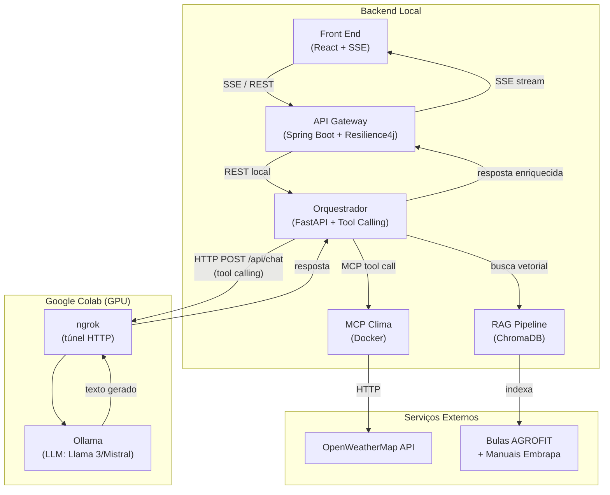

# Especificação da Arquitetura

## 1. Visão Geral

O sistema **Manejo Inteligente de Pragas Agrícolas** é uma aplicação distribuída que combina recuperação de informação técnica (RAG) com dados ambientais em tempo real (MCP) para apoiar decisões de manejo fitossanitário.

A principal decisão arquitetural é a **separação em dois ambientes de execução com responsabilidades estritamente isoladas**, garantindo que uma falha ou reinicialização no servidor de inferência não comprometa o estado da aplicação (Tolerância a Falhas, princípio de Sistemas Distribuídos).

---

## 2. Ambientes de Execução

### 2.1 Backend Local (Máquina do Desenvolvedor / Servidor On-Premise)

Concentra toda a lógica de negócio, orquestração e persistência. Por ser local, os dados do ChromaDB sobrevivem a reinicializações do Colab.

| Componente | Tecnologia | Papel |
|---|---|---|
| Front End | React + EventSource API | Interface do usuário (SSE consumer) |
| API Gateway | Java + Spring Boot | Broker SSE, borda do sistema |
| Orquestrador | Python + FastAPI + httpx | Maestro: integra RAG, monta prompt, tool calling |
| RAG + Vector Store | ChromaDB + sentence-transformers | Recuperação semântica de documentos |
| MCP Clima | Python + SDK `mcp` (Docker) | Wrapper/Adapter sobre OpenWeatherMap |

### 2.2 Servidor de Inferência (Google Colab — GPU Remota)

Responsabilidade única: executar o modelo de linguagem e retornar o texto gerado. Não há lógica de negócio aqui.

| Componente | Tecnologia | Papel |
|---|---|---|
| Ollama | Llama 3 / Mistral / Gemma | Servidor de inferência LLM |
| ngrok | Túnel HTTP | Expõe a porta 11434 como URL pública temporária |

> **Por que ngrok?** O Colab não possui IP público estático. O ngrok cria um túnel seguro sem necessidade de configuração de firewall, resolvendo o problema de **Transparência de Localização** (o Orquestrador chama `http://<ngrok-url>/api/chat` sem saber onde fisicamente o modelo roda).

> **Tradeoff:** a URL do ngrok muda a cada reinicialização do Colab e precisa ser atualizada no `.env`. Em produção real, substituir por uma GPU dedicada (ex: RunPod, AWS EC2 com GPU) eliminaria esse atrito.

---

## 3. Diagrama de Componentes



---

## 4. Fluxo de Dados (Caminho de Leitura — Fase 2)

### Fase 1 — Entrada e Orquestração Local

1. **Usuário** envia uma pergunta no Front End (ex: *"Como tratar ferrugem asiática com chuva amanhã?"*).
2. **Front End** abre uma conexão SSE via `EventSource` apontando para o API Gateway — escolha de **SSE sobre WebSocket** porque o fluxo é unidirecional (servidor → cliente) e SSE usa HTTP/1.1 nativo, sem handshake adicional.
3. **Gateway** autentica a requisição, cria um `SseEmitter` e delega ao Orquestrador via REST local. O Circuit Breaker (Resilience4j) protege contra falha do Orquestrador (Tolerância a Falhas).
4. **Orquestrador** aciona o módulo RAG: o ChromaDB retorna os *k* trechos mais relevantes de bulas AGROFIT e manuais Embrapa usando similaridade semântica (embeddings sentence-transformers).

### Fase 2 — Enriquecimento e Inferência

5. O Orquestrador monta o **prompt enriquecido** (pergunta + trechos RAG) e envia via `HTTP POST /api/chat` para o Ollama, junto com a **definição das tools disponíveis** (ex: `get_weather`).
6. A **LLM decide autonomamente** se precisa de dados climáticos com base na pergunta. Se sim, retorna um `tool_call` com o nome da tool e parâmetros (ex: `{"cidade": "Lavras"}`). O Orquestrador executa a tool via MCP Clima, retorna o resultado à LLM, que gera a resposta final enriquecida.
7. A resposta sobe: Orquestrador → Gateway (via `SseEmitter`) → Front End, incluindo os dados climáticos estruturados quando disponíveis. A conexão SSE é encerrada ao final do stream.

---

## 5. Contrato da API do Orquestrador

O Orquestrador expõe um único endpoint. Gateway e Front dependem deste contrato — não alterar sem comunicar a equipe.

**`POST /consulta`**

```json
// Request
{
  "pergunta": "string"
}

// Response
{
  "resposta": "string",
  "fontes": [
    {
      "titulo": "string",
      "trecho": "string",
      "pagina": "number"
    }
  ],
  "mcp_invocados": ["string"],
  "clima": {                    // presente apenas quando a LLM invocou get_weather
    "disponivel": true,
    "cidade": "string",
    "temperatura_c": "number",
    "sensacao_termica_c": "number",
    "umidade_pct": "number",
    "vento_kmh": "number",
    "descricao": "string",
    "nuvens_pct": "number"
  }
}
```

---

## 6. Stack Tecnológica Consolidada

| Camada | Tecnologia | Justificativa |
|---|---|---|
| Frontend | React + EventSource API | SSE nativo no browser sem biblioteca adicional |
| Gateway | Java + Spring Boot + Resilience4j | Circuit Breaker maduro; ecossistema familiar ao time |
| Orquestrador | Python + FastAPI + httpx | Integra RAG, tool calling e LLM via Ollama /api/chat |
| Vector Store | ChromaDB (local) | Persistência em disco; sem custo; integrado ao LangChain |
| Embeddings | sentence-transformers (local) | Sem dependência de API externa; roda offline |
| Protocolo de Ferramentas | SDK `mcp` (Python) | SDK oficial do protocolo MCP; padrão da indústria |
| LLM | Ollama (Llama 3 / Mistral / Gemma) | GPU gratuita no Colab; troca de modelo sem redeployment |
| Túnel | ngrok | Expõe Colab sem configuração de rede |
| Containerização | Docker Compose | Isola MCP Clima; facilita setup do time |

---

## 7. Propriedades de Sistemas Distribuídos Atendidas

| Propriedade | Como é atendida |
|---|---|
| **Transparência de Localização** | Orquestrador acessa Ollama via URL ngrok sem conhecer a localização física da GPU |
| **Transparência de Acesso** | Gateway e Front operam via REST/SSE padrão, sem saber detalhes internos do Orquestrador |
| **Tolerância a Falhas** | Circuit Breaker no Gateway; healthchecks no Docker Compose; separação de ambientes (Colab pode reiniciar sem perder ChromaDB) |
| **Desacoplamento** | MCP Clima em contêiner isolado; a LLM invoca tools via protocolo padrão — novas tools podem ser adicionadas sem alterar o Orquestrador |
| **Escalabilidade (potencial)** | Orquestrador stateless permite múltiplas instâncias atrás do Gateway |
